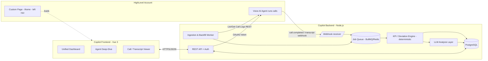

# Voice AI Observability Copilot — Architecture & Implementation Plan

**Author:** Sanjeev (Team of One — Product · Design · Engineering · QA)
**Version:** 0.1 (Plan / pre-build)
**Date:** July 2026
**Target platform:** HighLevel (GoHighLevel) Marketplace App + Voice AI Public APIs

> This is the design document that governs the build. It is written so it can drop straight into the GitHub repo as `ARCHITECTURE.md` and seed the README. Code has not been written yet — this locks the approach, the data contracts, and the integration surface first so the implementation is mechanical.

---

## 1. Problem & Objective

HighLevel Voice AI agents run live phone calls (lead qualification, booking, routing, support triage). Today, confirming that an agent is actually meeting its goal is a manual chore: someone opens call logs, reads transcripts one by one, and eyeballs whether the agent followed the script and hit the success criteria. That doesn't scale, it's inconsistent, and problems are found days late.

The **Voice AI Observability Copilot** automates the **Monitor** and **Analyze** phases of the agent lifecycle. It ingests call transcripts as they happen, scores every call against the agent's own goals/KPIs, surfaces deviations and missed opportunities, and produces concrete prompt/script fixes. It lives *inside* the HighLevel account as a Marketplace app, so operators never leave the CRM.

This closes the **Validation Flywheel**: the agent runs → calls are observed and scored → failures become recommendations → the operator updates the agent prompt/script → the next batch of calls validates the change. Observability is the feedback loop that makes agents improve instead of drift.

### Success criteria for this tool
- **Time-to-insight:** from "call ended" to "scored + flagged in dashboard" in under ~60 seconds (webhook path).
- **Coverage:** 100% of calls scored automatically, not a sampled manual review.
- **Actionability:** every flagged call links to (a) the exact transcript segment and (b) a specific, copy-pasteable recommendation.
- **Zero-leave integration:** runs as a Custom Page inside the HighLevel left nav.

---

## 2. Product Thinking

### 2.1 Who uses this

| Persona | Job-to-be-done | What they need from the Copilot |
|---|---|---|
| **Agency operator / "AI ops"** | Keep dozens of client agents performing | A single dashboard ranking agents by health; alerts when one regresses |
| **Agent builder / prompt engineer** | Improve one agent's script | Per-agent failure clustering + recommended prompt edits with evidence |
| **Account owner / client** | Trust that the agent is doing its job | Plain-language KPI trend (booking rate, containment, sentiment) |
| **QA reviewer** | Spot-check high-risk calls | A queue of exactly the calls that need a human, not all of them |

### 2.2 The two observability loops (from the brief)

**Loop A — Monitor (Observability).** Ingest and analyze existing Voice AI transcripts. Let the operator set observability parameters from the agent's goals/script. Detect deviations, failures, and missed opportunities against the KPIs in the logs.

**Loop B — Analyze (Unified Dashboard).** Visualize issues across all agents in one view. Turn failures into immediate, specific recommendations for prompt/script/agent changes. Highlight **"Use Actions"** — the specific call segments that need a human or should become training examples.

### 2.3 What we measure — the KPI taxonomy

KPIs are grouped so the same engine serves any agent type. Each agent inherits a default set and can override thresholds.

**Outcome KPIs (did the call achieve the goal?)**
- Goal completion rate (booked / qualified / transferred / resolved — the agent's declared objective)
- Containment rate (handled without human transfer, where that's the goal)
- Escalation/transfer rate and *reason*
- Voicemail / no-connect rate

**Conversation-quality KPIs (how well did it run?)**
- Script adherence — did the agent cover required steps (greeting, identity capture, disclosure, CTA)?
- Required-data capture — name, phone/email, qualifying fields present in transcript?
- Objection handling — did it recover, or drop the call?
- Dead-air / interruption / talk-over signals (from timing metadata when available)
- Sentiment trajectory (start → end) and frustration markers
- Compliance/guardrail hits (off-topic, PII mishandling, prohibited claims)

**Efficiency KPIs**
- Turns-to-goal, call duration vs. agent baseline, repeated-question loops

### 2.4 What "a failure" looks like (deviation types)
1. **Missed goal** — call ended without the declared objective.
2. **Missed opportunity** — buying signal / booking intent present but not acted on.
3. **Script deviation** — a required step was skipped or done out of order.
4. **Recovery failure** — objection or confusion led to a drop instead of a re-ask/handoff.
5. **Compliance breach** — guardrail violated.
6. **Data gap** — required field never captured.

Every detected item carries a severity, a transcript span (start/end offset), and a suggested fix category. This is the join between Monitor and Analyze.

---

## 3. System Architecture

### 3.1 High-level shape



### 3.2 Components

**1. GHL Marketplace App (the shell).** A distributable app installed into a sub-account (or agency). It grants OAuth scopes, registers webhooks, and exposes a **Custom Page** that renders our Vue dashboard inside HighLevel's left navigation via an iframe. Built from the official [`GoHighLevel/ghl-marketplace-app-template`](https://github.com/GoHighLevel/ghl-marketplace-app-template).

**2. Ingestion layer (two paths).**
- *Real-time:* a webhook receiver subscribed to Voice AI call/transcript events. On `call completed` / `transcript generated`, we enqueue the call for scoring. This is the low-latency path.
- *Backfill:* a worker that calls the **Voice AI Call Log APIs** — *List Call Logs* (filter by agent, contact, call type, action type, date range; 1-based pagination) and *Get Call Log* (full detail incl. transcript) — to pull historical calls when the app is first installed, or to reconcile anything the webhook missed. Idempotent on `callId`.

**3. KPI / Deviation Engine (deterministic core).** Pure functions, no LLM. Given a normalized transcript + agent config, it computes the KPI table and emits typed deviations (Section 2.4). Deterministic = reproducible, testable, cheap, and it runs on 100% of calls even if the LLM layer is rate-limited or down. This is the reliability backbone.

**4. LLM Analysis Layer (judgment + language).** For each call (or cluster of calls) the engine flags, the LLM does what rules can't: nuanced script-adherence judgment, root-cause explanation, and drafting the actual recommended prompt edit. It runs against a real provider (OpenAI/Anthropic) with the **key supplied at runtime via env var**. Output is strictly schema-constrained JSON (Section 6) so the frontend can render it reliably. LLM calls are cached by transcript hash so re-renders are free.

**5. Persistence.** PostgreSQL for agents, calls, transcripts, KPI results, deviations, and recommendations. Redis + BullMQ for the job queue (retry/backoff, dedupe).

**6. REST API.** Serves the dashboard, exposes agents/calls/deviations/recommendations, and handles the OAuth install callback + token refresh.

**7. Frontend (Vue 3).** Three surfaces — the unified dashboard, the per-agent deep-dive, and the call/transcript viewer — embedded as the Custom Page.

### 3.3 Why this split (deterministic engine + LLM layer)
Rule-based scoring is fast, free, reproducible, and unit-testable — perfect for hard KPIs (was a field captured? was a step present? did the call transfer?). LLMs are essential for the soft, judgment-heavy parts (was the objection *handled well*? what's the *fix*?). Putting the LLM *after* the deterministic pass means we only spend tokens where human-like judgment adds value, and the dashboard still works if the LLM budget is exhausted. This is the same "cheap filter → expensive judge" pattern that keeps the flywheel affordable at scale.

---

## 4. HighLevel Integration (the real, non-mocked surface)

### 4.1 App model & auth
- Create a developer account on the **Marketplace Portal**, create a **sandbox** sub-account under the **Testing** tab, and register the app under **My Apps**.
- Auth is **OAuth 2.0 Authorization Code grant** (v2/v3 APIs). The app exposes a GET redirect endpoint that receives `code`, exchanges it for an access + refresh token, and stores tokens per `locationId`. A scheduled refresh keeps tokens live.
- **Scopes (requested at minimum):** Voice AI read (agents, call logs), Conversations/read for transcript context, and Custom Menu/Custom Page as needed for surfacing. *(Exact scope strings are confirmed against the Voice AI API reference during build — see Section 12 open items.)*

### 4.2 Getting transcripts in — two mechanisms, belt and suspenders
1. **Webhooks (primary, real-time).** Subscribe to Voice AI call events. HighLevel delivers real-time call outcomes, transcripts, and summaries; the **Transcript Generated** trigger fires when transcription finishes and carries full transcript, duration, direction, caller location, and timestamps. Our receiver verifies the signature, dedupes on `callId`, and enqueues.
2. **Call Log REST (backfill + reconcile).** *List Call Logs* (scoped to location, filterable, paginated) to discover calls; *Get Call Log* to fetch full transcript detail. Runs on install (historical import) and on a cron to catch anything webhooks dropped.

### 4.3 Surfacing the UI inside HighLevel
- The dashboard is a **Custom Page**: an externally hosted HTTPS Vue app that HighLevel embeds in an **iframe** in the left nav after install.
- Hosting rules we must honor: serve over **HTTPS**; **do not** send `X-Frame-Options: DENY/SAMEORIGIN`; set CSP `frame-ancestors` to allow HighLevel domains; make cross-site cookies work in an embedded context.
- **Context passing:** HighLevel injects `{{location.id}}`, `{{user.email}}`, etc. into the page URL query string. For anything trust-sensitive we use the **signed user context** flow (validated server-side) rather than trusting query params. `location.id` scopes every dashboard query to the right sub-account.
- Optional **Custom JS** module / **Custom Menu Link** with SSO can provide additional entry points if we want the Copilot reachable from elsewhere in the nav.

### 4.4 Agent config → observability parameters
When the app loads for a location, we call *List Agents* / *Get Agent* to read each agent's configuration and prompt/script. From that we auto-derive a first-draft KPI set and required-step checklist (e.g., a booking agent → goal = appointment booked, required steps = identity + qualify + offer slot + confirm). The operator then tunes thresholds and required steps in the UI. This is how "set observability parameters based on the agent's goals/script" becomes concrete instead of manual.

---

## 5. Data Model (core tables)

```
agent            (id, ghl_agent_id, location_id, name, type, prompt_snapshot,
                  goal, kpi_config JSONB, created_at)
call             (id, ghl_call_id UNIQUE, agent_id, location_id, contact_id,
                  direction, started_at, duration_s, outcome, source[webhook|backfill])
transcript       (call_id, turns JSONB[ {role, text, t_start, t_end} ], raw_ref)
kpi_result       (call_id, kpi_key, value, passed BOOL, threshold, computed_at)
deviation        (id, call_id, type, severity, span_start, span_end,
                  evidence_text, suggested_fix_category)
recommendation   (id, agent_id, scope[call|agent], title, rationale,
                  proposed_prompt_diff TEXT, confidence, supporting_call_ids[],
                  status[open|applied|dismissed], created_at)
use_action       (id, call_id, span_start, span_end, reason[human_review|training],
                  status)
oauth_token      (location_id, access_token, refresh_token, expires_at)
```

`kpi_config` is per-agent JSON so thresholds and required steps are editable without a migration. `deviation.span_*` and `use_action.span_*` are the offsets that let the UI jump to the exact transcript moment.

---

## 6. Observability & Analysis Logic

### 6.1 Deterministic pass (KPI/Deviation Engine)
Runs first, on every call. Examples of concrete checks:
- **Required-step coverage:** regex/keyword + lightweight classifier over turns to confirm each declared step appears. Missing/out-of-order → `script_deviation`.
- **Data capture:** did a valid email/phone/name/qualifying answer appear? Missing → `data_gap`.
- **Outcome mapping:** map call outcome + action events to goal-completion (booked/transferred/resolved). No goal + intent present → `missed_goal` / `missed_opportunity`.
- **Guardrails:** deny-list / compliance patterns → `compliance_breach`.
- **Signal features:** turn counts, dead-air gaps, repeated questions (from timing metadata).

Output: the `kpi_result` rows + typed `deviation` rows with severity and transcript spans.

### 6.2 LLM pass (judgment + recommendations)
Triggered for calls with open deviations, and periodically at the **agent level** to cluster recurring failures. The LLM receives: the transcript, the agent's goal/script, and the deterministic findings. It returns **strict JSON**:

```jsonc
{
  "call_id": "…",
  "verdict": "missed_goal",
  "root_cause": "Agent asked for the appointment before confirming the caller's timezone, so the offered slot was wrong and the caller disengaged.",
  "evidence": [{ "span_start": 84.2, "span_end": 97.9, "quote": "…" }],
  "recommendation": {
    "scope": "agent",
    "title": "Confirm timezone before offering slots",
    "proposed_prompt_diff": "+ Before proposing any appointment time, confirm the caller's timezone and restate it.",
    "confidence": 0.82
  },
  "use_action": { "reason": "training", "span_start": 84.2, "span_end": 97.9 }
}
```

Agent-level aggregation turns many similar call findings into **one prioritized recommendation** ("14 of term-booking calls failed for the same timezone reason — here's the prompt edit"), which is what the operator actually acts on. Recommendations are ranked by `severity × frequency × confidence`.

### 6.3 "Use Actions"
Any span the engine marks `human_review` (e.g., an angry caller, a compliance-risky exchange, a lost high-intent lead) or `training` (a great/poor example worth teaching from) becomes a **Use Action** — a queue item in the dashboard that deep-links to the exact transcript segment. This is the bridge from observation to human intervention / script training the brief calls for.

---

## 7. Dashboard (UI/UX)

Three surfaces, embedded as the Custom Page:

**A. Unified Dashboard (all agents).** Top strip: portfolio KPIs (goal-completion, containment, avg sentiment, calls scored today) with trend sparklines. Main: an **agent health table** ranked by a composite health score, each row showing calls, goal rate, top failure type, and a trend arrow (regression = red). A "needs attention" rail lists the highest-severity open recommendations and the Use-Actions queue count. This answers "which agent is slipping *right now*."

**B. Agent Deep-Dive.** For one agent: KPI trends over time, a **failure-type breakdown** (missed goal / script deviation / recovery failure / data gap / compliance), and the ranked **recommendation cards** — each with rationale, evidence calls, and a copy-paste prompt diff plus Apply/Dismiss. This is where the builder fixes the agent.

**C. Call / Transcript Viewer.** The transcript with **deviations highlighted inline** on the exact spans, sentiment trajectory, KPI checklist (pass/fail), and any Use-Action markers. Click a finding → scroll to the moment. This is the evidence layer that makes every recommendation trustworthy.

Design principles: native to HighLevel (match its spacing/typography so it feels built-in, not bolted-on); evidence is always one click away; nothing is a dead-end — every number drills down to the calls behind it.

---

## 8. Tech Stack & Repo Structure

**Backend:** Node.js (TypeScript) + Express/Fastify, PostgreSQL (Prisma), Redis + BullMQ, Zod for schema validation (incl. LLM output), official GHL OAuth flow. LLM via provider SDK, key from `process.env`.

**Frontend:** Vue 3 (`<script setup>`, TypeScript, Pinia, Vue Router), Vite, a charting lib (e.g. Chart.js/ECharts), Tailwind for HighLevel-native styling.

```
/ghl-voice-observability
  /apps
    /backend        # Node API, webhook receiver, workers, engine, LLM layer
      /src
        /ingestion  # webhook + backfill
        /engine     # deterministic KPI/deviation (pure, unit-tested)
        /analysis   # LLM prompts, schema, aggregation
        /api        # REST + OAuth
        /db         # prisma schema, migrations
      /test
    /frontend       # Vue 3 Custom Page app
  /packages
    /shared         # shared TS types (KPI, deviation, recommendation contracts)
  /marketplace-app  # app manifest, scopes, webhook + custom-page config
  /docs
    ARCHITECTURE.md  # this file
    INSTALL.md       # sandbox setup & run steps
  /fixtures          # sample transcripts for offline dev & tests
  README.md
```

Monorepo so the KPI/deviation/recommendation **type contracts live in `/packages/shared`** and both backend and frontend import them — the data shape can't drift between engine and UI.

---

## 9. What's Real vs. Mocked

| Area | Plan |
|---|---|
| GHL OAuth install + token refresh | **Real** against sandbox |
| Voice AI Call Log ingestion (List/Get) | **Real** — attempted end-to-end against sandbox (unverifiable from this environment; validated during build) |
| Webhook real-time transcript ingestion | **Real** where the sandbox emits events; `/fixtures` replay used to develop and to demo deterministically |
| Deterministic KPI/deviation engine | **Real**, fully functional, unit-tested |
| LLM recommendation layer | **Real**, live provider, key via env var at runtime |
| Custom Page embedding in HighLevel | **Real** — hosted HTTPS, iframe-embedded |
| Sample transcripts in `/fixtures` | **Mocked** — realistic seed data so the dashboard is demoable without waiting for live calls |

The honest line for the README: *real-time transcript ingestion, deterministic scoring, and LLM recommendations are functional; fixture transcripts exist only to make the dashboard demoable offline and to drive tests.*

---

## 10. Install & Run in a HighLevel Sandbox (to be delivered as INSTALL.md)

1. **Sandbox:** In the Marketplace Portal → **Testing** tab, create a sandbox sub-account. Create/enable a Voice AI agent and place a couple of test calls so logs exist.
2. **Register app:** Marketplace Portal → **My Apps** → Create App. Set redirect URL to `<backend>/oauth/callback`, request the Voice AI + Conversations scopes, register the webhook URL `<backend>/webhooks/ghl`, and add a **Custom Page** pointing at `<frontend-url>?location_id={{location.id}}&user_email={{user.email}}`.
3. **Backend:** `cp .env.example .env` and fill `GHL_CLIENT_ID`, `GHL_CLIENT_SECRET`, `DATABASE_URL`, `REDIS_URL`, `LLM_API_KEY`, `LLM_PROVIDER`. Run `pnpm i && pnpm db:migrate && pnpm dev`. Expose it over HTTPS (ngrok/Cloudflared in dev) so HighLevel can reach the webhook and iframe.
4. **Frontend:** `pnpm dev` (or build + host). Ensure no `X-Frame-Options` and a `frame-ancestors` CSP allowing HighLevel.
5. **Install:** From the sandbox, install the app → complete OAuth → the Copilot appears in the left nav. Backfill imports historical calls; new calls stream in via webhook.
6. **Demo path (offline-safe):** `pnpm seed:fixtures` replays sample transcripts through the real engine + LLM so the dashboard is populated regardless of live-call availability.

---

## 11. Team-of-One Ownership (Product · Design · Engineering · QA)

As a single owner, I sequence the four hats deliberately rather than doing them at once:
- **Product** first — I fixed the personas, the KPI taxonomy, and the deviation types (Sections 2, 6) *before* touching code, so the engine is built to answer real questions, not to show off features. Scope is deliberately narrow: nail Monitor + Analyze, defer the "Act/auto-apply prompt edits" loop.
- **Design** — three surfaces, one job each (portfolio triage → agent fix → evidence). HighLevel-native styling so it reads as part of the CRM. Every metric drills to its underlying calls; no dead-ends.
- **Engineering** — the deterministic-core / LLM-judge split (Section 3.3) is the key architectural bet: it keeps the system testable, cheap, and resilient, and it's what lets one person ship something reliable. Shared type contracts prevent engine/UI drift.
- **QA** — the deterministic engine is unit-tested against `/fixtures` transcripts with known-correct KPI/deviation expectations (regression-proof). LLM output is schema-validated (Zod) so malformed responses fail loud, not silent. A golden-set of ~15 hand-labeled calls measures recommendation precision. Webhook idempotency and OAuth refresh get integration tests.

The through-line: **constrain the LLM, test the deterministic core, and keep scope to the flywheel's two loops** — that's how one person delivers something trustworthy instead of a demo that falls over.

---

## 12. Build Plan & Open Items

**Milestones**
1. Marketplace app skeleton + OAuth install against sandbox; token storage/refresh.
2. Ingestion: webhook receiver + Call Log backfill; normalized transcript in DB.
3. Deterministic KPI/deviation engine + unit tests on fixtures.
4. LLM analysis layer + agent-level aggregation; schema-validated recommendations.
5. Vue dashboard (3 surfaces) as Custom Page, embedded in sandbox.
6. Use-Actions queue, polish, QA golden-set, INSTALL.md, demo recording.

**Open items to confirm during build (flagged honestly, not guessed):**
- Exact **OAuth scope strings** and whether Voice AI call-log read is a distinct scope — confirm against the live Voice AI API reference.
- Exact **webhook event names/payload schema** for Voice AI call completion vs. the Conversations "Transcript Generated" trigger, and which one carries the full transcript most reliably.
- Whether **timing/dead-air metadata** is present in the call-log payload (affects a few conversation-quality KPIs; those degrade gracefully if absent).
- Rate limits on List/Get Call Logs for the initial backfill (may need throttled paging).

---

## 13. Source References
- Voice AI Public APIs overview (Agents, Actions, Call Logs incl. transcripts, webhooks): https://help.gohighlevel.com/support/solutions/articles/155000006379-voice-ai-public-apis
- Voice AI API reference (dashboard): https://marketplace.gohighlevel.com/docs/ghl/voice-ai/voice-ai-api
- Call Logs for Voice AI Agents: https://help.gohighlevel.com/support/solutions/articles/155000005900-call-logs-for-voice-ai-agents
- Transcript Generated workflow trigger (payload contents): https://help.gohighlevel.com/support/solutions/articles/155000006632-workflow-trigger-transcript-generated
- Custom Pages (iframe embedding, context vars, hosting rules): https://marketplace.gohighlevel.com/docs/marketplace-modules/CustomPages
- Custom JS module: https://marketplace.gohighlevel.com/docs/marketplace-modules/custom-js
- OAuth 2.0: https://marketplace.gohighlevel.com/docs/ghl/oauth/oauth-2-0-v-3
- Conversation AI & Voice AI (sandbox via Testing tab, prerequisites): https://marketplace.gohighlevel.com/docs/marketplace-modules/ConversationsAIandVoiceAI
- Official Marketplace app template: https://github.com/GoHighLevel/ghl-marketplace-app-template
